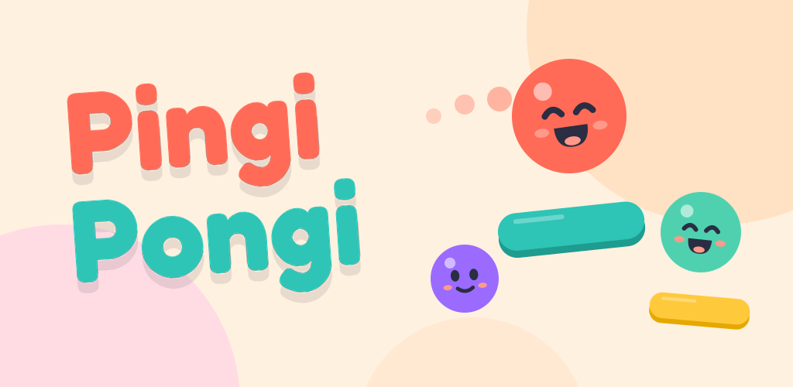

# Pingi Pongi

A cheerful paddle game for Android by **Ocean Forge**.

[Website](https://serdumenn.github.io/pingi-pongi/) · [Google Play](https://play.google.com/store/apps/details?id=com.oceanforge.pingipongi) · [Privacy policy](https://serdumenn.github.io/pingi-pongi/privacy/)

## Game

- **Solo:** Classic, Rush, Daily Challenge and Ghost Challenge
- **One device:** Table Duel, Co-op Rally and Party Table for up to 4 players
- **Online:** Portal Duel, Live Duel, Rush Battle for up to 4 players and Online Co-op Rally
- **Social:** friend codes, invites, world and friends rankings
- **Progress:** Google Play Games sign-in with cloud backup
- **Languages:** English, Türkçe, 日本語, 한국어, Deutsch, Español, Português, Français

## Technology

| Area | Stack |
|---|---|
| Engine | Unity 6000.3.25f1, UI Toolkit |
| Online | Unity Gaming Services: Authentication, Relay, Leaderboards, Cloud Save, Cloud Code, Friends |
| Platform | Android: Google Play Games, Google Play Billing, AdMob with UMP consent |
| Quality | EditMode and PlayMode tests, GitHub Actions CI |

## Repository

| Path | Contents |
|---|---|
| `Assets/_Game` | Game code, UI, art, audio and localization |
| `ArtSource` | Source art and asset generators |
| `docs/design` | Game design and technical specifications |
| `docs/release` | Release runbook and store materials |
| `.github/workflows` | CI pipelines |

## Builds

- Every push to `main` runs the tests and builds a development APK.
- A `v*` tag (for example `v1.0.0`) runs the tests and builds the signed release AAB.

Setup: [docs/CI-ANDROID.md](docs/CI-ANDROID.md) and [docs/release/README.md](docs/release/README.md).

## License

Proprietary. © 2025-2026 Ocean Forge. All rights reserved. See [LICENSE](LICENSE).
