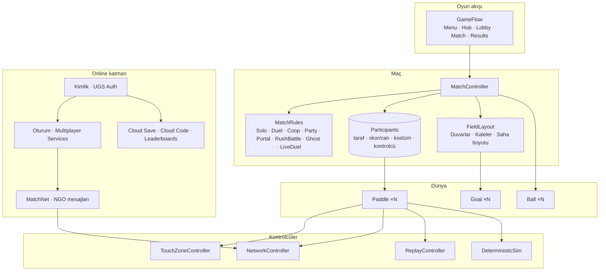
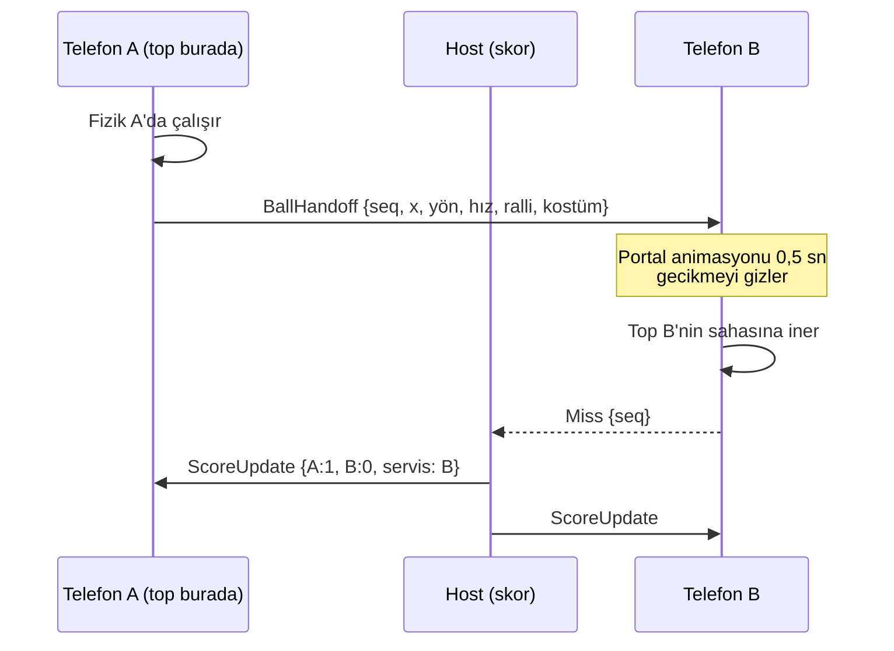

# Özellik: Çok oyunculu modlar — entegrasyon planı

*v1 · 2026-10-01 · Durum: **Kapı M0 geçildi — M1 başladı***

Fikir panosu (mod taslakları ve karşılaştırma): [Pingi Pongi Çok Oyunculu](https://claude.ai/artifact/F8swRbu67w4WJ8JchhwABS)

Karar: ürün sahibi yedi modun hepsini istiyor. Bu doküman, mevcut projeyi bozmadan hepsini hangi sırayla, hangi mimariyle ve hangi kontrol noktalarıyla ekleyeceğimizi tanımlar.

| Mod | Nerede | Tür | Faz |
|---|---|---|---|
| Masa Düellosu | Aynı telefon | 2 kişi, rakip | M1 |
| Ortak Ralli | Aynı telefon ve online | 2 kişi, takım | M1 + M3 |
| Parti Masası | Aynı tablet | 3–4 kişi, herkes kendine | M1 |
| Pas Düellosu | Online | 2 kişi, rakip | M3 |
| Rush Kapışması | Online | 2–4 kişi, rakip | M4 |
| Hayalet Meydan Okuma + Günün Meydan Okuması | Sırayla (async) | Arkadaşlar / herkes | M4 |
| Canlı Düello | Online, gerçek zamanlı | 2 kişi, rakip | M5 |

---

## 1. Mevcut durum analizi

### 1.1 Tek oyuncu varsayımının gömülü olduğu yerler

| Dosya | Bugün | Çok oyunculu için sorun |
|---|---|---|
| `Core/SoloGameManager.cs` | Tek top, tek raket, tek `ModeRunner`, tek skor; durum makinesi Menu/Playing/Paused/GameOver | Katılımcı kavramı yok; birden çok raket, top ve skor taşıyamıyor |
| `Gameplay/SoloBall.cs` | Tek `Paddle` referansı; raket vuruşunu "bu raket mi" diye kontrol ediyor; `bottom` etiketli tetik = kaçırma; servis tek raketin dokunuşuyla | Hangi raketin vurduğunu ve hangi kalenin (alt/üst/sol/sağ) kaçırdığını bilmeli |
| `Gameplay/RacketController.cs` | Ekranın alt yarısı = giriş bölgesi; yalnız yatay; sabit `baseY` | Taraf (alt/üst/sol/sağ), eksen ve giriş kaynağı (dokunma bölgesi, ağ, hayalet, simülasyon) parametrik olmalı |
| `Gameplay/ResponsiveWalls.cs` | Tavan = duvar, zemin = kaçırma, sabit 9:16 saha | Topolojiye göre kale ve duvar dizilimi; Parti'de tam ekran saha |
| `Cosmetics/SkinApplier.cs` | Kostümü tek top ve tek rakete uygular | Her katılımcının kendi kostümü |
| `UI/GameUI.cs` + ekranlar | Tek HUD, tek oyun sonu | Merkez (hub), lobi, ters çevrilmiş üst HUD, rakip çubuğu, sonuç ekranı |
| `Core/RecordsService.cs` | Tek oyunculu koşu istatistikleri | Maç istatistikleri (galibiyet, yenilgi, en uzun ortak ralli) ayrı tutulmalı |
| `Cosmetics/CosmeticsService.cs` | Oyun sonunda Classic rekoruna göre kilit açar | Çok oyunculu maçlar skor kilidi açmamalı; seriye sayılmalı |
| `Services/AudioManager.cs` | Tek seri sayacı | Katılımcı başına perde |

### 1.2 Teknik notlar
- **Rastgelelik:** `SoloBall` servis yönünü ve duvar sekmesini Unity'nin genel üretecinden alıyor. Hayalet ve Günün Meydan Okuması için tohumlanabilir (seeded) bir üretece geçmeli.
- **Fizik:** 50 Hz sabit adım, sürekli çarpışma algılama. Physics2D cihazlar arasında bit düzeyinde aynı sonucu garanti etmez. Bu yüzden Canlı Düello için deterministik bir simülasyon gerekir (Bölüm 4.7).
- **Etiketler:** `bottom` etiketi kaleyi belirliyor; yerine `Goal` bileşeni ve taraf bilgisi gelecek.
- **Unity Cloud:** `cloudProjectId` boş; proje bir Unity Cloud projesine bağlı değil. Online fazların ilk koşulu bu (hesap işi, sende).
- **Paket uyumu (6000.3.25f1):**
  - Multiplayer Services 2.3.3
  - Netcode for GameObjects 2.13.3
  - Transport 2.7.4
  - Authentication 3.8.0
  - Cloud Save 3.4.1
  - Cloud Code 2.10.4
  - Leaderboards 2.3.4
  - Multiplayer Play Mode 2.0.2
- **Test altyapısı yok:** Oyun kodu `Assembly-CSharp` içinde. Unity test assembly'leri `Assembly-CSharp`'a referans veremediği için önce oyun kodu bir assembly definition'a taşınmalı.

---

## 2. Hedef mimari



### 2.1 Çekirdek kavramlar
- **Participant:** Taraf (Bottom/Top/Left/Right), takım, skor ve can, kostüm (top, raket), kontrolcü türü (Yerel dokunma, Ağ, Hayalet, Simülasyon).
- **MatchRules:** Mevcut `ModeRunner`'ın genelleşmiş hâli. Vuruş puanı, kaçırma sonucu, kazanma koşulu, saat ve ek top kuralları. Classic ve Rush da bu yapıya geçer; davranışları bit düzeyinde aynı kalır ve testlerle korunur.
- **FieldLayout:** Topoloji (TekSaha, ÜstAlt, DörtKenar, Portal) → duvar, kale ve saha boyutu. `ResponsiveWalls`'un yerini alır; güvenli alan ve sabit saha kuralları korunur.
- **Ball / Paddle / Goal:** `SoloBall` → `Ball`. Hangi raketin vurduğunu ve hangi kalenin kaçırdığını olayla bildirir. `RacketController` → `Paddle` (taraf ve eksen). `Goal` kaleyi tanımlar.
- **Kontrolcüler:**
  - `TouchZoneController`: ekranın bir bölgesine giren parmağı o oyuncuya bağlar; çoklu dokunuşta parmak kimliğiyle takip eder.
  - `NetworkController`: raketi ağdan gelen pozisyonla oynatır.
  - `ReplayController`: hayalet kaydını oynatır.
  - `DeterministicSim`: yalnız Canlı Düello.
- **GameFlow:** `SoloGameManager`'ın durum makinesi, Hub, Lobby ve Results durumlarıyla genişler. Tek oyunculu akış aynı kalır.

### 2.2 Klasör ve assembly yapısı
```
Assets/_Game/Scripts/
  Core/          GameFlow, Match, Participants, Rules, Records, Seeds
  Gameplay/      Ball, Paddle, Goal, FieldLayout, Replay
  Multiplayer/   Online: Auth, Sessions, MatchNet, Handoff, Rollback  (Pingi.Multiplayer.asmdef)
  UI/            Ekranlar
  Editor/
  Tests/EditMode, Tests/PlayMode
```
Assembly'ler: `Pingi.Runtime`, `Pingi.Multiplayer` (yalnız online paketlere bağımlı), `Pingi.Editor`, `Pingi.Tests.EditMode`, `Pingi.Tests.PlayMode`. Böylece testler mümkün olur ve online kod çevrimdışı koddan ayrı kalır.

### 2.3 Online servis seçimi (öneri: tek çatı UGS)

| İhtiyaç | Öneri | Not |
|---|---|---|
| Oyuncu kimliği | UGS Authentication, anonim | İsteğe bağlı Google Play Games bağlama yayın fazında |
| Eşleşme | Multiplayer Services Sessions: arkadaş kodu + hızlı eşleşme | Oturum özelliklerinde mod ve protokol sürümü; eski sürümler eşleşmez |
| Bağlantı | Relay + Netcode for GameObjects (host-client) | İlk 50 ortalama eşzamanlı kullanıcı ücretsiz |
| Mesajlar | NGO özel mesajları (`MatchNet`) | Topun el değiştirmesi, skor, saldırı, tepki, rövanş |
| Hayalet kayıtları | Cloud Save + Cloud Code | 6 haneli meydan okuma kodu sunucuda üretilir |
| Sıralamalar | UGS Leaderboards (günlük/haftalık/tüm zamanlar) | Play Games planının yerine; tek çatı, sohbetsiz |
| Testler | Multiplayer Play Mode | Tek bilgisayarda en fazla 4 oyuncu (ana Editor + 3 sanal oyuncu) |

Oyuncu adları serbest metin değil, üretilmiş adlar olacak ("Neşeli Penguen" gibi). Sohbet yok; 4 hazır tepki var. Böylece moderasyon gerekmez ve yaş derecelendirmesi sade kalır.

---

## 3. Fazlar

Her fazın sonunda bir onay kapısı var. Kapıdan geçmeyen iş bir sonraki faza taşınmaz. Süreler, tek geliştirici ve yapay zekâ yönetimi varsayımıyla kaba tahmindir.

### M0 — Zemin (2–3 hafta) · çevrimdışı, hesap gerektirmez
1. **Test altyapısı:** Oyun kodunu assembly definition'lara taşı. EditMode ve PlayMode test projeleri; CI'da build'den önce test adımı (`game-ci/unity-test-runner`).
2. **Koruma testleri:** Bugünkü davranış için testler. Classic ve Rush puanlama, seri, envanter kuralları, rekorlar, kostüm uygulama ve oyun akışı. Refaktör bu testler yeşilken yapılır.
3. **Çekirdek refaktör:** Participant, MatchRules, FieldLayout, Ball/Paddle/Goal ve kontrolcüler. Tek oyunculu modlar yeni yapı üzerinde, birebir aynı davranışla çalışır.
4. **Tohumlu rastgelelik:** Maç başına `MatchRandom` (servis yönü, sekme sapması).
5. **Tasarım kapısı:** Hub, lobi, ters HUD, sonuç ekranı ve parti düzeni için tel çerçeve ve stil kareleri (`docs/design/multiplayer/index.html`).
6. **Açık iş:** Dolap bildiriminin konumunu düzelt.

**M0 durumu (2026-10-01):**

| Adım | Durum |
|---|---|
| 1 · Test altyapısı | ✅ Kodda 4 assembly var. Testler: EditMode 74, PlayMode 10. CI'da `test` işi build'den önce çalışıyor; CI'daki ilk koşu senin bir sonraki push'unla doğrulanacak |
| 2 · Koruma testleri | ✅ Kapsam: Classic ve Rush puanlama, süre ve ceza, rekorlar, seri (gece yarısı, yıl dönümü, saat geri), envanter ve Pass kuralları, katalog verisi, kostüm giydirme ve kalıcılık, skor ve seri ödülleri, duraklatma. Ralli testinde raket topu gerçek dokunuşla takip ediyor ve hız artışı ölçülüyor |
| 3 · Çekirdek refaktör | ✅ `Ball`, `Paddle` + `IPaddleController` + `TouchZoneController`, `Goal`, `FieldLayout`, `MatchRules`, `Participant`. Testler refaktörden sonra da yeşil |
| 4 · Tohumlu rastgelelik | ✅ `MatchRandom` (mulberry32). Aynı tohum aynı servisi veriyor (PlayMode testi) |
| 5 · Tasarım kapısı | ✅ [multiplayer/index.html](multiplayer/index.html) **onaylandı (2026-10-01)**, önerilen seçeneklerle |
| 6 · Açık iş | ✅ Dolap bildirimi üste taşındı. "Reklam hazır değil" ve "mağaza hazır değil" yolları Editor'de görsel olarak doğrulandı |

**M1'e bırakılanlar:** Parmağın başladığı bölgeye kilitlenmesi (4.1), `Participant`'ta skor ve can, `FieldLayout`'ta ÜstAlt ve DörtKenar topolojileri. Bunları ilk kullanan modlar M1'de geliyor; şimdiden yazmak kullanılmayan kod olurdu.

**Kapı M0:**
- Tüm testler yeşil, 13 cihaz düzen denetimi temiz.
- Tek oyunculu oyun cihazda öncekiyle aynı hissettiriyor.
- Ekran tasarımları onaylı.

### M1 — Aynı cihaz (3–4 hafta) · çevrimdışı
- **Masa Düellosu:**
  - Topoloji ve giriş: ÜstAlt topoloji; ekranın üst yarısı üstteki, alt yarısı alttaki oyuncunun.
  - Kurallar: 5 sayıya ulaşan kazanır; her sayıdan sonra servisi kaybeden atar.
  - Arayüz: üst HUD 180° dönük.
- **Ortak Ralli (yerel):** Aynı düzen, takım kuralları; 3 ortak can, skor toplam pas.
- **Parti Masası (tablet):**
  - DörtKenar topoloji; sol ve sağ raketler dikey.
  - Can sistemi var; elenen oyuncunun kenarı duvara dönüşür; 15 sayıda ikinci top gelir.
  - Tam ekran saha; 600dp altındaki cihazlarda gizli.
- **Kostümler:** Cihaz sahibinin açtığı kostümler her oyuncuya seçtirilir.
- **Kayıt:** Maç istatistikleri ayrı tutulur; maçlar günlük seriye sayılır, skor kilidi açmaz.
- **Arayüz ve ses:** Menüde "Arkadaşla oyna" → Hub: Bu cihazda / Online / Meydan okuma. Yeni sesler: geri sayım, sayı, galibiyet, beraberlik.

**M1 iş dökümü (2026-10-01):**

| Adım | İçerik |
|---|---|
| M1.1 Kurallar ve veri | Üç mod varlığı (Table Duel, Co-op Rally, Party Table). `Participant`'a skor, can, elenme ve görünüm eklenir. `TableDuelRules`, `CoopRallyRules`, `PartyRules` yazılır; EditMode testleri |
| M1.2 Dünya | `FieldLayout` topolojileri: Tek, ÜstAlt, DörtKenar. Kenarlar duvar ya da kale olarak açılıp kapanır; parti için kare saha ve köşe blokları. Raket kurulumu (taraf, konum, açı, renk) ve parmak kilidi. Top her raketten servis edebilir, ortadan otomatik servis yapabilir; ikinci top |
| M1.3 Maç yöneticisi | `LocalMatchController`: kurulum → geri sayım → oyun → sayı → sonuç → rövanş; duraklatma. Kayıtlar: maç sayısı, en uzun ortak ralli, günlük seri. Seri ödülü ve mevcut reklam kuralı |
| M1.4 Arayüz | Menüde Together kartı, merkez (3 sekme; Online ve Challenges M2'ye kadar "yakında"), görünüm seçimi, üç modun HUD'u, geri sayım, maç duraklatma, sonuç ekranı |
| M1.5 Asset | Yeni ikonlar, oyuncu raketleri (P1–P4 renkleri), sesler (geri sayım, sayı, galibiyet) |
| M1.6 Test ve QA | Kural testleri. PlayMode testleri: iki parmakla düello ve parmak kilidi, ortak can, partide elenme ve ikinci top. Tek oyunculu testler yeşil kalır. 13 cihaz denetimi yeni ekranlarla; tablette parti |

**M1 durumu (2026-10-01):**

| Adım | Durum |
|---|---|
| M1.1 Kurallar ve veri | ✅ `TableDuelRules`, `CoopRallyRules`, `PartyRules`. Üç mod varlığı. Maç kayıtları: maç sayısı, en uzun ortak ralli, günlük seri |
| M1.2 Dünya | ✅ `FieldLayout` üç topoloji. Kale ↔ duvar geçişi (`Goal.SetOpen`). Parti: kare saha, köşe blokları, kapalı kenar çubuğu. Düello: orta çizgi. Raket taraf/açı/renk kurulumu, parmak kilidi. Her raketten servis, otomatik servis, ikinci top |
| M1.3 Maç yöneticisi | ✅ `LocalMatchController`: kurulum → 3-2-1 → oyun → sonuç → rövanş, duraklatma, çıkış. Seri ödülü ve reklam kuralı maçlarda da geçerli |
| M1.4 Arayüz | ✅ Together kartı, merkez (Online ve Challenges "yakında"), görünüm seçimi (düello yarıları, partide dört kenar), maç HUD'u, geri sayım, sonuç |
| M1.5 Asset | ✅ İkonlar (`people`, `heart`), dört oyuncu raketi, dört ses |
| M1.6 Test ve QA | ✅ EditMode 83, PlayMode 18 test. Yeni ekranlarla 13 cihaz denetimi: 87 ekran durumu (menü kartı, merkez, düello kurulum/HUD/sonuç, ortak ralli HUD'u, tabletlerde parti kurulum/HUD/sonuç). Bulunan 3 sorun düzeltildi; yeniden denetimde sorun çıkmadı |

**Denetimde düzeltilenler:**
- **Together kartı:** Açıklama 16:9 ekranlarda iki satıra iniyor ve Play butonunu raketin üstüne itiyordu. Açıklama kısaltıldı: "Play with your friends".
- **Parti etiketleri:** Tabletlerde sol ve sağ oyuncu etiketleri ekrandan taşıyordu. Kort payı 0,55'ten 0,8 birime çıktı.
- **Ortak ralli HUD'u:** Pas sayısı servis noktasındaki topun üstüne biniyordu; düellodaki skorlar gibi sola alındı.
- **Koruma:** Tek oyunculu oyun sürerken maç açılamaz.
- **Skorlar (2026-10-03):** "Me" sekmesine "With friends" paneli eklendi: oynanan maç sayısı ve en uzun ortak ralli.

**Tasarım ayrıntıları (onaylı tasarımla uyumlu, uygulamada netleşti):**
- **Raketler:** Oyuncu renginde (P1 mercan, P2 turkuaz, P3 güneş, P4 üzüm). Kimliği renk ve konum birlikte verir.
- **Kostüm:** Her oyuncunun seçtiği kostümü top taşır; topa en son kim vurduysa onun kostümüne bürünür.
- **Servis:**
  - Düello ve ortak ralli: sayıyı kaybeden, dokunarak servis atar.
  - Parti: top 1 sn sonra ortadan, rastgele bir oyuncuya doğru kendiliğinden çıkar.
- **Ortak ralli hızı:** Top her vuruşta tek oyunculudaki gibi hızlanır; Perfect vuruş topu %6 yavaşlatır, ama servis hızının altına düşürmez.

**Kapı M1:** İki kişiyle tek telefonda, dört kişiyle tablette cihaz testi; küçük telefonda ergonomi kontrolü.

### M2 — Online altyapı (2–3 hafta) · **senin hesap adımın gerekli**
- **Senden:** Unity Cloud projesi oluştur ve bağla (Unity Dashboard).
- **Altyapı:** Paketleri kur:
  - Authentication
  - Multiplayer Services
  - NGO
  - Transport
  - Cloud Save
  - Cloud Code
  - Leaderboards
  - Multiplayer Play Mode
- **Kimlik:** Anonim giriş; üretilmiş oyuncu adı; profilde kostüm.
- **Oturum:** Kod ile oluştur ve katıl; hızlı eşleşme; protokol sürümü kontrolü.
- **Dayanıklılık:**
  - Uygulama arka plana atılınca ve bağlantı koparsa: 10 sn yeniden bağlanma süresi, sonra maç biter.
  - İnternet yoksa online kartları nazikçe kapat.
- **Lobi ekranı:** Oyuncular, kostümleri, hazır durumu, geri sayım.
- **Gizlilik:** Ayarlar'a "Online verilerimi sil" (UGS hesabını siler). Data Safety notları.

**Kapı M2:** Multiplayer Play Mode'da iki sanal oyuncu kodla eşleşip lobide buluşuyor; iki telefonla Wi-Fi ve mobil veri testi.

**M2 iş dökümü (2026-10-03):**

| Adım | İçerik |
|---|---|
| M2.1 Kurulum | Paketler: Authentication 3.8.0, Multiplayer Services 2.3.3, Netcode for GameObjects 2.13.3 (Transport bağımlılık olarak gelir), Multiplayer Play Mode 2.0.2. Cloud Save, Cloud Code ve Leaderboards, kullanılacakları M3/M4'te eklenir. Unity Cloud projesi bağlantısı senden |
| M2.2 Kimlik | `OnlineService`: UGS başlatma, anonim giriş; durumlar: çevrimdışı, bağlanıyor, hazır, hata. `PlayerNames`: oyuncu kimliğinden türetilen "Adjective Animal" adı, aynı hesapta hep aynı ad. Editor'de her sanal oyuncu ayrı profille girer |
| M2.3 Oturum | `OnlineLobby`: kodla özel oda, kodla katılma, hızlı eşleşme. Hızlı eşleşme mod ve protokol sürümüne göre süzer; uygun oda yoksa yenisini açar. Oyuncu verisi: ad, kostüm, hazır. Oda verisi: mod, protokol sürümü. Relay ağı ve NetworkManager; lobide gecikme (ms) |
| M2.4 Dayanıklılık | İnternet yoksa Online sekmesi açıklamayla kapanır. Kopma ya da arka plan: 10 sn yeniden bağlanma, sonra lobiden çıkış. Hata mesajları: kod bulunamadı, oda dolu, sürüm farklı |
| M2.5 Arayüz | Online sekmesi (oyuncu adı; Quick match, Create code, Join code; mod listesi), kod girme, lobi (kod oluşturuldu, ikisi hazır, 3-2-1), yeniden bağlanma katmanı, Ayarlar'da "Delete my online data". Yeni ikonlar: kopyala, paylaş |
| M2.6 Test ve QA | EditMode: ad üretici, kod biçimi, lobi durumu. Multiplayer Play Mode'da iki sanal oyuncu. Yeni ekranlarla 13 cihaz denetimi |

- Maçın kendisi M3'te gelir. M2'de geri sayım bittiğinde lobi "Portal Duel is coming" notuyla açık kalır.

**M2 durumu (2026-10-03):**

| Adım | Durum |
|---|---|
| M2.1 Kurulum | ✅ Paketler kuruldu, derleme temiz. Unity Cloud projesi "Pingi Pongi" bağlandı (2026-10-04) |
| M2.2 Kimlik | ✅ `OnlineService` (Services nesnesinde) ve `PlayerNames` (32 sıfat × 32 hayvan = 1024 ad). Giriş, Online sekmesi ilk açıldığında yapılır; yalnız tek kişilik oynayan biri için UGS hesabı açılmaz |
| M2.3 Oturum | ✅ `OnlineLobby`, `SessionCode`, `LobbyPlayer`. NetworkManager yalnız online'a girilince kodla oluşturulur; sahnede durmaz, tek oyunculu oyunu etkilemez. Canlı denendi (aşağıda) |
| M2.4 Dayanıklılık | ✅ Yeniden bağlanma (10 sn, geri sayım halkalı pencere), arka planda 10 sn'den uzun kalınca lobiden çıkış, host ayrılması. İnternet yoksa Online sekmesi "You're offline", sunucuya ulaşılamazsa "Can't reach the servers" kartı ve Try again. Hata mesajları: kod bulunamadı, oda dolu, sürüm farklı, bağlantı koptu, arkadaşın ayrıldı |
| M2.5 Arayüz | ✅ Online sekmesi: oyuncu adı ve topu, görünüm değiştirme (askı), Quick match, Create code, Join code, mod listesi (Portal Duel ve Co-op Rally seçilebilir; Rush Battle ve Live Duel "Soon"). Kod girme penceresi: küçük harf ve boşluk düzelir. Lobi: kod kartı (Kopyala, Paylaş, 10 dk süre), oyuncu yuvaları, VS kartları ve gecikme, Ready, 3-2-1. Ayarlar'da "Online data → Delete". Yeni ikonlar: bolt, share, copy, join, wifi, wifi_off |
| M2.6 Test ve QA | EditMode 94, PlayMode 18 test yeşil. Editor'de uçtan uca deneme: kod oluştur, ikinci oyuncu katılır, ikisi hazır, geri sayım; silme akışı iki durumda. 13 cihaz denetimi: 7 ekran durumu × 13 cihaz. Tek gerçek bulgu iPad Pro'da lobi durum metninin kırpılma riskiydi; düzeltildi ve yeniden denetlendi. Kod penceresinin altında kalan butonlar ve cihaz geçişi sırasında alınan ölçümler yanlış alarm |

**Canlı deneme (2026-10-04, Editor + ikinci UGS örneği):**

| Durum | Sonuç |
|---|---|
| Anonim giriş, üretilmiş ad | ✅ "Mighty Narwhal" |
| Kodla oda kurma, relay host | ✅ Kod `HLK8F8`; NetworkManager host olarak dinliyor |
| Kodla katılma | ✅ İkinci oyuncu "Rosy Walrus"; ev sahibi adı ve kostümü görüyor |
| Hazır olma, ikisi hazır | ✅ İki yönde eşitleniyor; `AllReady` doğru |
| Dolu oda | ✅ Üçüncü oyuncu "Full" alıyor |
| Ayrılma | ✅ Ev sahibinde oyuncu sayısı düşüyor |
| Kapanmış odanın kodu | ✅ "NotFound"; küçük harf ve boşluklu yazım da çalışıyor |
| Hatalı karakterli kod | ✅ "NotFound". UGS kodları 6 karakter, ama her harf geçerli değil (ör. `Z` reddediliyor); bu yüzden giriş alanı harf kısıtlamaz, sunucunun cevabına bakar |
| Hızlı eşleşme | ✅ Açık oda yoksa kendisi açıyor; ikinci oyuncu aynı odaya düşüyor |
| Relay istemci bağlantısı, gecikme, host ayrılması, yeniden bağlanma | ⏳ İki ayrı oyuncu süreci gerekiyor: Multiplayer Play Mode ya da iki telefon (Kapı M2) |

- Test için açılan iki geçici oyuncu hesabı denemeden sonra silindi.

### M3 — Pas Düellosu ve online Ortak Ralli (3–4 hafta)
- **Topun el değiştirmesi (bkz. 4.4):** Top tavandaki portaldan çıkınca sahibi `BallHandoff` mesajı gönderir. Alıcı, portal animasyonu sırasında topu kendi sahasında başlatır; animasyon gecikmeyi gizler.
- **Host otoritesi:** Skor, kazanma ve rövanş host'ta. Her cihaz yalnızca topu kendi sahasındayken fiziği yürütür.
- **Etkileşim:** 4 hazır tepki ve rövanş isteği.
- **Kostüm:** Top rakibin sahasına geçince onun kostümünü giyer.

**Kapı M3:**
- Ağ simülatöründe 200 ms gecikme ve %5 paket kaybıyla oynanabilirlik.
- İki telefonda 20 maçlık test.

**M3 iş dökümü (2026-10-04, onaylandı):**

| Adım | İçerik |
|---|---|
| M3.1 Ağ mesajları | NGO adlı mesajları (`CustomMessagingManager`); prefab ya da NetworkObject yok. Mesajlar: `MatchStart` (tohum, ilk servis), `BallHandoff` (seq, x, yön, hız, ralli, kostüm), `Miss`, `ScoreUpdate`, `MatchEnd`, `Reaction`, `Rematch`. Aynı `seq` iki kez gelirse yok sayılır; onaylanmayan el değiştirme 1 sn sonra yeniden gönderilir |
| M3.2 Saha ve portal | Tek kişilik saha, tavanda portal. Top portaldan çıkınca el değiştirme mesajı gider. Alıcı tarafta top aynalanmış x'ten (rakibin solu benim sağım), 0,5 sn portal animasyonuyla iner. Saha boyutları iki tarafta 9:16'ya normalize |
| M3.3 Maç yöneticisi | `OnlineMatchController`: geri sayım → oyun → sonuç → rövanş. Skor, kazanma ve servis sırası host'ta. Portal Duel: 5 sayıya ulaşan kazanır. Online Co-op Rally: 3 ortak can, skor toplam pas. Kopma: 10 sn bekleme, sonra kalan oyuncu kazanır |
| M3.4 Arayüz | Maç HUD'u: üstte rakip kartı (ad, skor, bağlantı), altta kendi skorun. 4 tepki butonu, gönderilen tepki 1,5 sn yukarı süzülür. Sonuç ekranında rövanş isteği. Lobi geri sayımı bitince maç başlar |
| M3.5 Asset | Portal halkası (SVG, teal), tepki ikonları (başparmak, şaşkın, gülen, ateş), sesler: portal geçişi, tepki |
| M3.6 Test ve QA | EditMode: mesaj yazma/okuma, tekilleştirme ve yeniden gönderme, aynalama, kurallar. Editor'de iki oyuncu (Multiplayer Play Mode) ve ağ simülatörü (200 ms, %5 kayıp). Yeni ekranlarla 13 cihaz denetimi. Senden: iki telefonla 20 maç |

**M3 durumu (2026-10-04):**

| Adım | Durum |
|---|---|
| M3.1 Ağ mesajları | ✅ `MatchMessage` (sürümlü ikili biçim), `IMatchLink`, `NetcodeLink` (NGO adlı mesaj `pingi.match`, güvenilir ve sıralı). NGO zaten güvenilir teslim ettiği için yeniden gönderme yok; tekrarlanan `Handoff` ve `Miss` sıra numarasıyla yok sayılır |
| M3.2 Saha ve portal | ✅ `FieldTopology.Portal`: alt kenar kale, üst kenar portal; portal rakip kartının altına iner (2,4 birim). Teal portal çizgisi ve `PortalView` halkası (çıkışta büyüyüp söner, girişte 0,5 sn'de belirir). Top çıktığı x'in aynasından, yönü aynalanarak ve aynı hızla iner |
| M3.3 Maç yöneticisi | ✅ `OnlineMatchController` ve `OnlineMatchRules`. Skor, kazanma, servis ve ortak can host'ta; misafir `Miss` gönderir, host `Score` yayınlar. Sayıyı kaybeden servis atar. Rakip koparsa 10 sn beklenir, sonra kalan kazanır; lobiden ayrılırsa hemen kazanır. Rövanş: iki taraf da isteyince host yeniden başlatır |
| M3.4 Arayüz | ✅ Maç HUD'u: rakip kartı (top, ad, skor ya da ortak canlar, bağlantı), ortada büyük soluk skor, geri sayım, "Your serve · tap to start", 4 tepki ve süzülen baloncuk, "Leave the match?" ve "Reconnecting…" pencereleri. Sonuç: "You win!" / "So close!", skor, rövanş durumu ("wants a rematch!", "Waiting for…", "left the match"), Rematch / Accept ve ana sayfa. Lobi artık kendi geri sayımını yapmaz: "Connecting to…", "Waiting for…", "Starting…" |
| M3.5 Asset | ✅ İkonlar: `thumb`, `wow`, `laugh` (ateş mevcut). Sprite: `Art/Sprites/Online/spr_portal_ring.svg`. Sesler: `sfx_portal`, `sfx_reaction` |
| M3.6 Test ve QA | ✅ EditMode 100, PlayMode 24. Sahte bağlantıyla oyun içi testler: servis portaldan çıkar, gelen top aynalanır, kaçırma bildirilir, tekrarlanan mesaj yok sayılır, host skoru ve maç sonu, rövanş, ortak ralli, kopma. **Gerçek relay ile uçtan uca:** Editor host, aynı süreçte ikinci bir UGS örneği ve kendi NetworkManager'ı olan bir bot misafir. Bot relay üzerinden bağlandı (gecikme 180–240 ms), tam maç 5–4 oynandı, rövanş başladı, maç ortasında ayrılan botun yerine kalan oyuncu kazandı. **Kötü bağlantı (2026-10-05):** bot her mesajı iki yönde 200 ms (±30) geciktirdi, kayıp paketleri bir tur gecikmeyle yeniden gönderdi (sıra korunarak). %5 kayıpla Portal Duel 4–5 bitti, %10 kayıpla online Co-op 58 paslık ralli oynandı; iki tarafın skoru her an aynıydı. Gecikme yüzünden geri sayımı geç biten tarafa gelen top artık kaybolmuyor, geri sayım bitince iniyor (testi eklendi). Not: Gerçek UDP kaybını Netcode'un güvenilir kanalı karşılıyor; bu test onun uygulamaya yansıyan etkisini (gecikme) taklit ediyor. Multiplayer Tools paketinin ağ simülatörü kullanılmadı. ⏳ İki telefonla 20 maç |

- **Hazır bayrağı yarışı (düzeltildi):** Ready ve hemen ardından gelen "hazır değil" kaydı aynı anda gidince sunucunun cevabı ikincisini eziyordu. Oyuncu kayıtları artık sıraya alınıyor.

### M4 — Rush Kapışması ve meydan okumalar (4–5 hafta)
- **Rush Kapışması (2–4 kişi):**
  - Herkes kendi sahasında oynar; ağdan yalnızca skor ve saldırı olayları gider.
  - Art arda 3 Perfect, en yüksek skorlu rakibe saldırı gönderir: mini raket, hızlı top, sis.
  - Saldırı gelirken Perfect vurmak kalkan sayılır.
- **Hayalet Meydan Okuma:**
  - Tohumlu Rush koşusunun olay kaydı (sekme ve vuruş anları; yaklaşık 1–2 KB).
  - Cloud Code 6 haneli kod üretir; arkadaş kodu girip senin hayaletine karşı oynar.
  - Sonuç ekranında karşılaştırma.
- **Günün Meydan Okuması:**
  - Tohum tarihten türetilir (UTC); herkes aynı servis ve sekme dizisiyle oynar.
  - UGS günlük sıralaması.
- **Skorlar ekranı:** "Dünya" sekmesi UGS Leaderboards ile canlanır (Classic, Rush, Günlük, Ortak Ralli çiftleri).
- **Hile azaltma:** Sunucu tarafında makul skor üst sınırları; hayalet kaydı ile skor tutarlılık kontrolü.

**Kapı M4:** Multiplayer Play Mode'da 4 oyunculu Rush Kapışması; kod ile meydan okuma uçtan uca; günlük sıralama sıfırlanıyor.

**M4 iş dökümü (2026-10-05, onaylandı).** Üç parça halinde; her parça kendi başına çalışır:

| Adım | İçerik |
|---|---|
| **M4a Rush Battle** (yeni paket yok) | 2–4 oyuncu, herkes kendi sahasında Rush kuralıyla oynar. Host saati başlatır; oyuncular saniyede 4 kez skorunu gönderir, host herkese dağıtır. Art arda 3 Perfect, o an en yüksek skorlu rakibe saldırı gönderir: mini raket, hızlı top ya da sis (5 sn). Saldırı 1,5 sn önceden haber verilir; o arada Perfect vurursan kalkan olur. Süre bitince host sonuçları karşılaştırır. Arayüz: üstte rakiplerin küçük skor listesi, saldırı uyarı bandı, sonuç sıralaması |
| **M4b Günün Meydan Okuması ve Dünya sıralaması** (Leaderboards paketi) | Tohum UTC tarihinden; herkes aynı servis dizisiyle tek bir Rush koşusu oynar. Sıralamalar: Classic, Rush, Günlük (her gün sıfırlanır), Ortak Ralli. Meydan okumalar sekmesinde günlük kart (en iyin, sıran, kalan süre). Skorlar ekranındaki "World" sekmesi canlanır (ilk 10 ve senin sıran). Sıralama ayarları projede dosya olarak durur, Editor'deki Deployment penceresinden tek tıkla yüklenir |
| **M4c Hayalet Meydan Okuma** (Cloud Save + Cloud Code paketleri) | Tohumlu Rush koşusunun olay kaydı (servis, sekme, vuruş anları; sıkıştırılmış ~1–2 KB). Cloud Code karışık karakter içermeyen 6 haneli kod üretir, kaydı 7 gün saklar. Arkadaş kodu girer, senin hayalet topuna karşı aynı servislerle oynar; ekranda "+3 ahead" farkı, sonda karşılaştırma. Sunucuda makul skor sınırı ve kayıtla skor tutarlılık kontrolü |
| **Asset** | Saldırı ikonları (mini raket, hızlı top, sis), hayalet top görünümü, takvim ve hayalet ikonları, sesler: saldırı gönder/al, kalkan |
| **Test ve QA** | EditMode: saldırı hedefleme ve kalkan kuralı, skor yayını, günlük tohum, kayıt kodlama/çözme ve boyut, kod alfabesi, skor sınırı. Sahte bağlantıyla 3–4 oyunculu oyun içi testler; relay botlarıyla uçtan uca Rush Battle; 13 cihaz denetimi |

- **Senden gerekenler:** M4b ve M4c'de paket indirme izni (Leaderboards 2.3.4, Cloud Save 3.4.1, Cloud Code 2.10.4) ve sıralama ile Cloud Code dosyalarını Unity'de Deployment penceresinden bir kez "Deploy" etmen.

**M4a durumu (2026-10-05):** ✅ Rush Battle oynanabilir.

| Konu | Durum |
|---|---|
| Kurallar | `RushBattleRules`: kadro (oyuncu kimlikleri sıralı, sıra numarası buradan), her 3 Perfect'te saldırı, hedef en yüksek skorlu aktif rakip (eşitlikte küçük sıra), saldırı türü tohumlu rastgele, skor yalnız artar, bitiş, ayrılan, sıralama (eşit skor aynı yeri paylaşır), herkes isterse rövanş |
| Ağ | Yeni mesajlar: RushStart (tohum + kadro), RushScore (saniyede 4), Attack, Shield, RushFinal; tepki ve rövanş gönderenin sırasını taşır. Host, misafirlerden geleni herkese iletir. Protokol sürümü 2 |
| Koşu | Tek kişilik Rush aynen kullanılır: `SoloGameManager.StartBattleRun` sıralamaya sayılmayan koşu başlatır (rekor ve tek kişilik kayıt yazılmaz), geri sayımdan sonra top kendiliğinden fırlar. Kaçırınca servis yine dokunmayla; süre akmaya devam eder (tek kişilik Rush gibi). Maç sonunda "oynanan maç" kaydı |
| Saldırılar | 1,5 sn uyarı (sarı bant); bu arada Perfect = kalkan, saldırana bildirilir. Mini raket (%60, 5 sn), hızlı top (×1,35, 5 sn), sis (sahanın ortası 5 sn kapanır) |
| Arayüz | Tek kişilik Rush ekranının üstüne: rakip listesi (lider kırmızı, biten soluk, ayrılan silik), saldırı bandı, sis, durum notları ("Fog sent to…", "Blocked!", "… blocked your attack"), geri sayım, "Time's up! Waiting for the others…", tepkiler, çıkış penceresi. Sonuç: sıralama kartı (altın 1. sıra, senin satırın vurgulu, ayrılan "left"), "Play again" ve kim istediği. Lobi 2–4 kişi: en az 2 kişi ve herkes hazırsa başlar |
| Asset | İkonlar: `mini_paddle`, `fast_ball`, `fog`, `shield`. Sesler: `sfx_attack_send`, `sfx_attack_warn`, `sfx_shield` |
| Test | EditMode 109 (9 yeni), PlayMode 30 (6 yeni: misafir koşusu ve skor yayını, saldırının gelip geçmesi, Perfect ile kalkan, 3 Perfect'te liderin hedeflenmesi ve host'un iletmesi, bitiş ve rövanş, herkes ayrılınca kazanma). **Gerçek relay:** Editor host + relay botu; botun skoru canlı aktı (119'a kadar), botun sis saldırısı Editor'e ulaşıp uygulandı, iki taraf bitince sıralama çıktı. 13 cihaz denetimi: 39 ekran durumu (uyarı/oyun, bekleme, sıralama), sorun yok. Not: Bitiş skorunu süre + 8 sn içinde göndermeyen oyuncu ayrılmış sayılır, böylece kimse sonsuza kadar beklemez |

### M5 — Canlı Düello (6–8 hafta)
- **Deterministik simülasyon:** Kendi küçük, sabit noktalı (fixed-point) Pong simülasyonumuz. Mevcut top kurallarının birebir kopyası: hız artışı, en düşük dikey açı, sekme sapması.
- **Geri sarma (rollback):**
  - 60 Hz; ağdan yalnızca raket girdileri gider.
  - Geç gelen girdi tahmin edilir, yanlışsa geri sarılıp yeniden hesaplanır.
  - Kopma tespiti için periyodik durum özeti (checksum).
- **Görsel:** Simülasyon durumundan yumuşatılmış çizim; mevcut kostümler ve efektler.
- **Alternatif:** Photon Quantum. Hazır deterministik motor, ama oyun mantığının ona göre yeniden yazılması ve ikinci bir servis gerekir.
- **Testler:** Determinizm (aynı girdiler → aynı özet, binlerce maç), geri sarma doğruluğu, 150 ms gecikmede his.

**Kapı M5:** İki telefonda 150 ms gecikmede akıcı oyun; kopma testi; adalet (iki taraf aynı sonucu görüyor).

**Toplam:** yaklaşık 20–27 hafta. Her faz kendi başına yayınlanabilir.

---

## 4. Modların teknik tasarımı

### 4.1 Masa Düellosu
- **Saha:** ÜstAlt topoloji. Alttaki oyuncu bugünkü raket; üstteki ters yönde. Kaleler alt ve üst.
- **Giriş:** Ekran yatay çizgiyle ikiye bölünür. Her parmak başladığı bölgeye kilitlenir; diğer oyuncunun alanına kaysa bile kendi raketini sürer.
- **Kurallar:**
  - Kaçıran rakibe sayı verir; 5'e ulaşan kazanır (ayarlanabilir).
  - Top hızı her vuruşta artar ve her sayıda sıfırlanır.
- **HUD:** Skorlar orta çizginin iki yanında; üstteki 180° dönük. Duraklat butonu ortada.

### 4.2 Ortak Ralli
- **Yerel:** Masa Düellosu düzeni.
- **Online:** Pas Düellosu düzeni.
- **Kurallar:** 3 ortak can; skor = toplam pas. Her 10 pasta hız artar; Perfect topu biraz yavaşlatır.
- **Sıralama:** "En uzun ralli" çift sıralaması (online).

### 4.3 Parti Masası
- **Saha:** DörtKenar. Kare saha tabletin kısa kenarına sığdırılır, köşeler duvardır.
- **Kurallar:** 3–4 oyuncu, her birine 3 can. Elenen oyuncunun kenarı duvar olur. 15 sayıda ikinci top gelir; son kalan kazanır.
- **Giriş:** Her oyuncunun dokunma bölgesi kendi kenarına bitişik bir şerit.

### 4.4 Pas Düellosu (topun el değiştirmesi)

- Saha boyutları her iki tarafta normalize edilir (9:16). Giriş x'i aynalanır (rakibin solu benim sağım).
- Aynı mesaj iki kez gelirse `seq` ile tekilleştirilir. Kaybolan el değiştirmede gönderen 1 sn sonra tekrar yollar.
- Uygulama arka plana geçerse 10 sn bekleme; dönmezse rakip kazanır.

### 4.5 Rush Kapışması
- Herkes kendi `RushRules`'unu çalıştırır. Saniyede 4 kez skor yayını ve saldırı olayları gider.
- Saat host'tan başlar (ortak başlangıç anı). Bitişte skorlar host'ta karşılaştırılır.
- Saldırı hedefi lideri dengeler: saldırı en yüksek skorlu rakibe gider.

### 4.6 Hayalet ve Günün Meydan Okuması
- **Kayıt biçimi** (sürümlü, sıkıştırılmış, ~1–2 KB):
  - Başlık: sürüm, mod, tohum, süre, son skor, kostüm.
  - Olay listesi: sekme (ms, x, y, hız vektörü), vuruş (ms, perfect), kaçırma (ms).
  - Toplar çarpışmalar arasında düz gittiği için olay kaydı yeterli.
- **Oynatma:** Hayalet top ve skor çizgisi olaylar arasında ara değerlenir. Fizik yeniden çalıştırılmaz, cihaz farkı önemsizdir.
- **Kod:** Cloud Code, karışık karakterler olmadan 6 haneli bir kod üretir ve kaydı Cloud Save'e yazar. 7 gün geçerli.
- **Günlük tohum:** `hash(UTC tarih)`. Herkes aynı servis dizisini görür.

### 4.7 Canlı Düello (deterministik simülasyon + geri sarma)
- **Sabit nokta matematiği** (Q16.16): saha 5.625×10 birim; top dairesi; raket kapsülü.
- **Tik:** 60 Hz. Girdi = raketin hedef x'i (8 bit), son 5 tikle birlikte (kayba karşı) güvenilmez-sıralı kanaldan gider.
- **Geri sarma:** 15 tiklik durum halkası. Tahmin = son bilinen girdi. Düzeltme gelince geri sar ve yeniden hesapla.
- **Kopma tespiti:** Her 30 tikte durum özeti karşılaştırılır.
- **Testler:** Aynı girdi dizisi → aynı özet (EditMode, 10.000 rastgele maç); sabit nokta ile mevcut Physics2D davranışının görsel karşılaştırması.

---

## 5. Kalite ve test stratejisi

| Katman | Araç | Kapsam |
|---|---|---|
| EditMode | Unity Test Framework | Kurallar, kayıt ve sayaçlar, hayalet kodlayıcı, el değiştirme eşlemesi, deterministik simülasyon |
| PlayMode | Input System test düzeneği | Yerel düello akışı, çoklu dokunuş bölgeleri, oyun sonu ve rövanş |
| Online (Editor) | Multiplayer Play Mode | 2–4 sanal oyuncuyla eşleşme, el değiştirme, kopma |
| Ağ koşulları | Transport ağ simülatörü | 50 / 150 / 300 ms gecikme, %1–5 kayıp |
| Düzen | Mevcut 13 cihazlık denetim sürücüsü | Yeni ekranlar (hub, lobi, sonuç, dönük HUD) |
| Cihaz | CI APK'ları (artan sürüm) | 2 telefon + 1 tablet, her kapıda |
| CI | `unity-test-runner` + `unity-builder` | Her push'ta test, sonra build |

**Kural:** Tek oyunculu oyunun davranışı M0'dan sonra testlerle kilitlenir. Her faz bu testleri yeşil bırakmadan kapanmaz.

---

## 6. Etki: oyuna ve diğer sistemlere

| Sistem | Değişiklik |
|---|---|
| Menü | "Arkadaşla oyna" kartı → Hub |
| Skorlar | Dünya sekmesi UGS Leaderboards; yeni "Maçlar" bölümü (galibiyet/yenilgi, en uzun ortak ralli) |
| Kostümler | Rakip kostümleri görünür; yeni satın alma yok |
| Reklamlar | Online maç sırasında ve hemen sonrasında reklam yok; yerel maç sonunda mevcut geçiş kuralı (3 dk bekleme) |
| Seri | Biten her maç günlük seriye sayılır |
| Skor kilitleri | Yalnız tek oyunculu Classic rekoru (değişmez) |
| Ses | Yeni efektler aynı sentez betiğinden: portal, saldırı, tepki, geri sayım, galibiyet, yenilgi |
| Gizlilik | Data Safety: oyuncu kimliği, oyun etkileşimi. "Online verilerimi sil" |
| APK boyutu | NGO + servisler yaklaşık +3–5 MB |

---

## 7. Riskler

| Risk | Olasılık | Etki | Önlem |
|---|---|---|---|
| Refaktörde tek oyunculu oyunun bozulması | Orta | Yüksek | M0'da önce testler, sonra refaktör; cihaz kontrolü |
| Küçük telefonda iki kişilik ergonomi | Orta | Orta | Bölge sınırı ve top hızı ayarı; M1 kapısında test |
| Online maliyet | Düşük | Orta | Ücretsiz kotalar; panelde alarm |
| Hile (online skorlar) | Orta | Düşük–Orta | Host otoritesi, sunucuda skor sınırı, hayalet tutarlılığı |
| Canlı Düello'nun karmaşıklığı | Yüksek | Orta | En sona bırakıldı; Photon Quantum yedek planı |
| Hesap adımlarının gecikmesi | Orta | Orta | M0 ve M1 hesapsız ilerler |
| UGS kesintisi | Düşük | Düşük | Online kartları gizle; çevrimdışı modlar etkilenmez |

---

## 8. Senden gerekenler

| Ne zaman | Adım |
|---|---|
| Şimdi | Bu planı ve aşağıdaki kararları onayla |
| M0 sonu | Ekran tasarımlarını onayla |
| M2 başı | Unity Dashboard'da proje oluştur, Unity Editor'den projeye bağla. Ücretsiz kota için ödeme bilgisi istenirse sen girersin |
| Her kapı | İki telefon (ve varsa tablet) ile cihaz testi |

## 9. Kapı M0 kararları
- [x] Faz sırası M0 → M5 (2026-10-01)
- [x] Online servis: **UGS tek çatı** (2026-10-01)
- [x] Sıralamalar: **UGS Leaderboards**, Play Games sıralama planının yerine (2026-10-01)
- [x] Canlı Düello: **kendi deterministik simülasyonumuz** (2026-10-01)
- [x] Oyuncu adları: üretilmiş adlar, sohbet yok, 4 hazır tepki (2026-10-01)

## 10. Kapı M0 tasarım kararları (onay 2026-10-01)
- [x] Menü girişi: mod seçicide üçüncü kart **Together**; Play merkezi açar
- [x] İngilizce mod adları: Table Duel, Co-op Rally, Party Table, Portal Duel, Rush Battle, Ghost Challenge, Daily Challenge, Live Duel
- [x] Table Duel hedefi: 5 sayı
- [x] Oyuncu adları: üretilmiş "Adjective Animal", İngilizce
- [x] Tepkiler: başparmak, şaşkın, gülen yüz, ateş
- [x] Party Table telefonda kilitli görünür ("Tablet only")
